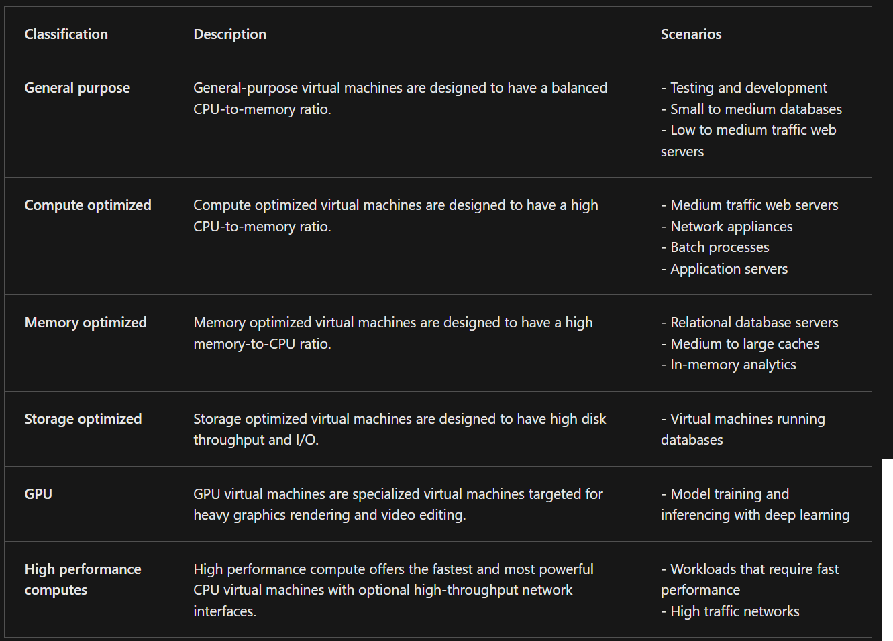
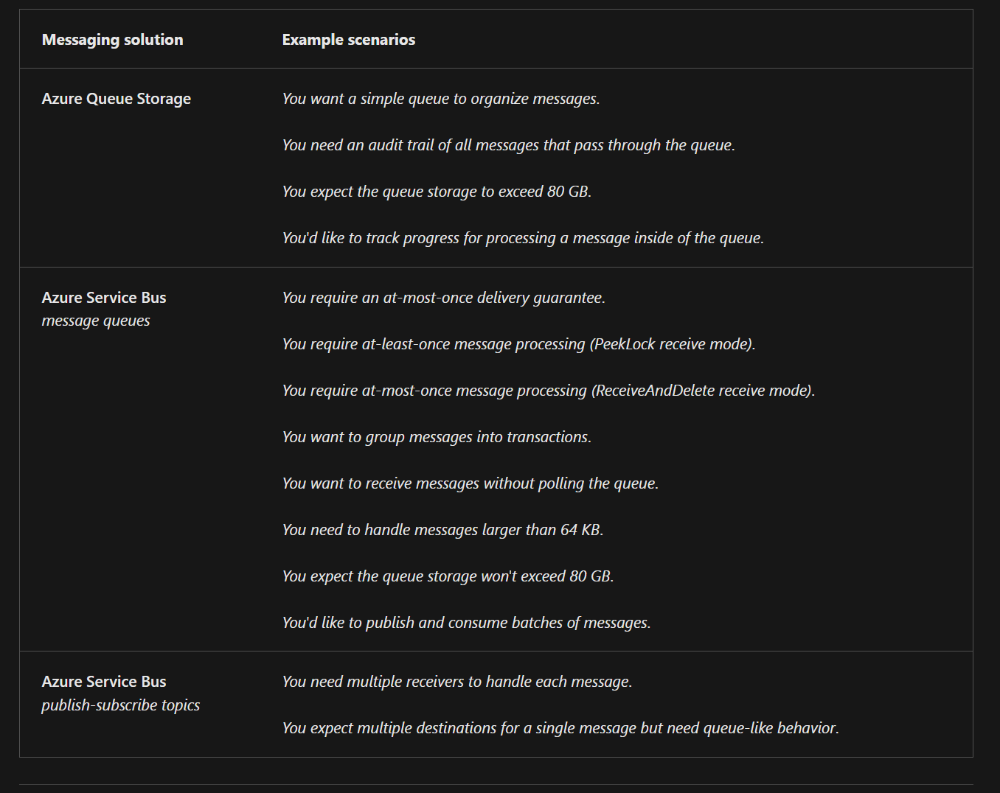

Tables and stuff to memorize for AZ305 exam.

All the content has been screenshotted in late June 2023 from the official [Microsoft Leaning pages](https://learn.microsoft.com/en-us/certifications/exams/az-305/)

# Table of contents
- [Table of contents](#table-of-contents)
- [1. Design identity, governance, and monitor solutions](#1-design-identity-governance-and-monitor-solutions)
  - [Governance](#governance)
    - [Differences between RBAC and Azure Policy:](#differences-between-rbac-and-azure-policy)
    - [Service principals VS MI (Managed Identity)](#service-principals-vs-mi-managed-identity)
  - [AuthN/AuthZ](#authnauthz)
    - [Differences between B2B and B2C:](#differences-between-b2b-and-b2c)
  - [Log monitor](#log-monitor)
    - [Deploy options for LAW:](#deploy-options-for-law)
    - [Access mode for LAW:](#access-mode-for-law)
    - [Types of Insights:](#types-of-insights)
- [2. Business continuity](#2-business-continuity)
  - [HA + DR](#ha--dr)
    - [SQL Server HA+DR solutions for SQL Server in VM](#sql-server-hadr-solutions-for-sql-server-in-vm)
- [3. Data storage](#3-data-storage)
  - [Non relational data](#non-relational-data)
    - [Types of Storage account](#types-of-storage-account)
    - [Blob storage tiers:](#blob-storage-tiers)
    - [Azure files performances:](#azure-files-performances)
    - [Comparisons between storage solutions:](#comparisons-between-storage-solutions)
    - [Azure managed disks:](#azure-managed-disks)
  - [Relational data](#relational-data)
    - [Compare SQL deployment options](#compare-sql-deployment-options)
    - [SQL Horizontal Scaling](#sql-horizontal-scaling)
    - [SQL Vertical Scaling](#sql-vertical-scaling)
    - [SQL scalability options](#sql-scalability-options)
    - [SQL availability options](#sql-availability-options)
    - [Protect data in motion](#protect-data-in-motion)
    - [Azure SQL Edge editions](#azure-sql-edge-editions)
    - [Azure Cosmo DB Table VS Storage Table](#azure-cosmo-db-table-vs-storage-table)
  - [Data Integration](#data-integration)
    - [Azure Data Lake VS Blob Storage](#azure-data-lake-vs-blob-storage)
    - [Azure Data Factory VS Azure Synapse](#azure-data-factory-vs-azure-synapse)
    - [Data Bricks, AZ Synapse, AZ HD Insight](#data-bricks-az-synapse-az-hd-insight)
- [4. Infrastructure](#4-infrastructure)
    - [VM sizes:](#vm-sizes)
    - [App Service price tiers:](#app-service-price-tiers)
    - [Storage for tier](#storage-for-tier)
    - [Pay-as-you-go VS Reserved Instances](#pay-as-you-go-vs-reserved-instances)
    - [Functions plans](#functions-plans)
    - [Max App Services per SKU](#max-app-services-per-sku)
    - [Container VS VM](#container-vs-vm)
    - [VM SLA](#vm-sla)
    - [Functions VS Logic APPS](#functions-vs-logic-apps)
    - [Messages services comparison](#messages-services-comparison)
    - [Event Grid VS Event Hubs VS Service Bus](#event-grid-vs-event-hubs-vs-service-bus)
    - [Express route types](#express-route-types)
    - [Network connectivity options](#network-connectivity-options)
    - [Network patterns](#network-patterns)
    - [NSG vs AZFW](#nsg-vs-azfw)
    - [NSG VS NVA](#nsg-vs-nva)
    - [Azure front door vs Azure CDN](#azure-front-door-vs-azure-cdn)
    - [Migrations options](#migrations-options)
    - [Migration tools](#migration-tools)
    - [Import/Export VS Data Box](#importexport-vs-data-box)

<small><i><a href='http://ecotrust-canada.github.io/markdown-toc/'>Table of contents generated with markdown-toc</a></i></small>

# 1. Design identity, governance, and monitor solutions 

##  Governance
### Differences between RBAC and Azure Policy:

### Service principals VS MI (Managed Identity)
| Feature                  | Service Principal                                               | Managed Identity                                             | User-Assigned Managed Identity                                 |
|--------------------------|-----------------------------------------------------------------|-------------------------------------------------------------|---------------------------------------------------------------|
| Purpose                  | Represents an application or service in Azure AD                 | Provides an identity to Azure resources                      | Provides an identity to Azure resources                       |
| Authentication           | Uses client ID and client secret or certificate for authentication | Uses Azure AD to authenticate the identity                  | Uses Azure AD to authenticate the identity                    |
| Creation                 | Manually created by the user or an administrator                 | Automatically created and managed by Azure                   | Manually created and assigned to specific Azure resources      |
| Scope                    | Can be assigned to multiple resources and subscriptions          | Created and assigned to a specific Azure resource            | Created and assigned to a specific Azure resource              |
| Lifecycle                | Requires management and rotation of client secrets or certificates | Managed and rotated automatically by Azure                   | Managed and rotated manually by the user                       |
| Resource Access Control  | Requires explicit role assignments for access to Azure resources  | Automatically inherits permissions based on the resource role | Automatically inherits permissions based on the resource role   |
| Application Integration  | Used for programmatic access to Azure resources                   | Used for programmatic access to Azure resources              | Used for programmatic access to Azure resources                |
| User Assignment Control  | No user assignment control                                       | No user assignment control                                   | Allows assignment to specific users or groups                  |
| Managed by               | User or administrator                                            | Azure                                                        | User or administrator                                        |

##  AuthN/AuthZ
### Differences between B2B and B2C:

## Log monitor
### Deploy options for LAW:

### Access mode for LAW:

### Types of Insights:

# 2. Business continuity

## HA + DR
### SQL Server HA+DR solutions for SQL Server in VM

# 3. Data storage

## Non relational data

### Types of Storage account

### Blob storage tiers:

### Azure files performances:

### Comparisons between storage solutions:

### Azure managed disks:

## Relational data

### Compare SQL deployment options

### SQL Horizontal Scaling

### SQL Vertical Scaling

### SQL scalability options

### SQL availability options

### Protect data in motion

### Azure SQL Edge editions

### Azure Cosmo DB Table VS Storage Table

## Data Integration

### Azure Data Lake VS Blob Storage

### Azure Data Factory VS Azure Synapse

### Data Bricks, AZ Synapse, AZ HD Insight

| Feature                | Azure Databricks                                      | Azure Synapse Analytics                               | Azure HDInsight                                       |
|------------------------|------------------------------------------------------|------------------------------------------------------|------------------------------------------------------|
| Purpose                | Collaborative Apache Spark-based analytics platform   | Unified analytics and data integration platform        | Open-source big data analytics platform               |
| Managed Service        | Yes                                                  | Yes                                                  | Yes                                                  |
| Use Case               | Big data processing, analytics, and machine learning  | Data warehousing, big data analytics, and ETL         | Big data processing, batch processing, and analytics |
| Key Technology         | Apache Spark                                         | Apache Spark, SQL, Data Lake, and data integration    | Apache Hadoop, Spark, Hive, HBase, and other tools    |
| Integration            | Integrates with various Azure services and tools      | Integrates with Azure services and Power BI            | Integrates with Azure services and open-source tools |
| Workload Flexibility   | Supports batch, streaming, and interactive workloads  | Supports batch, streaming, and interactive workloads  | Supports batch, interactive, and real-time workloads |
| Scalability            | Scales horizontally and vertically                    | Scales horizontally and vertically                    | Scales horizontally and vertically                    |
| Data Processing Speed  | High-performance in-memory processing                 | High-performance data processing                       | High-performance data processing                       |
| Data Integration       | Supports data ingestion, integration, and streaming    | Offers data integration and orchestration capabilities | Supports data ingestion, integration, and streaming    |
| Ecosystem and Languages | Supports multiple languages (Python, Scala, SQL, etc.) | Supports T-SQL, Spark SQL, and various languages      | Supports various programming languages and tools     |

# 4. Infrastructure
### VM sizes:

### App Service price tiers:
* Free
* Shared
* Dedicated - Basic, Standard, Premium, PremiumV2, PremiumV3
* Isolated - Isolated and IsolatedV2

### Storage for tier
|Tier|GB|
|-|-|
|Free|1 GB|
|Shared|1 GB|
|Basic|10 GB|
|Standard|50 GB|
|Premium|250 GB|
|Isolated|1 TB|

### Pay-as-you-go VS Reserved Instances

### Functions plans

### Max App Services per SKU

### Container VS VM

### VM SLA

| Deployment Configuration    | SLA Uptime Guarantee |
|----------------------------|---------------------|
| Single Instance VM         | 99.9%               |
| VMs in Availability Sets   | 99.95%              |
| VMs in Availability Zones  | 99.99%              |

### Functions VS Logic APPS

### Messages services comparison

### Event Grid VS Event Hubs VS Service Bus

### Express route types 

| ExpressRoute Type | Description                                                                                                   |
|------------------|---------------------------------------------------------------------------------------------------------------|
| Private Peering  | Establishes a private network connection between your on-premises network and Azure virtual networks.          |
| Microsoft Peering| Enables a connection to Microsoft cloud services, such as Azure, Microsoft 365, and Dynamics 365.             |
| Public Peering   | Provides connectivity to Azure services hosted on the public internet.                                        |
| Global Reach     | An add-on feature that enables connectivity between ExpressRoute circuits in different geopolitical regions.   |

### Network connectivity options

### Network patterns

### NSG vs AZFW

| Features              | Network Security Groups (NSGs)                                              | Azure Firewall                                                             |
|-----------------------|-------------------------------------------------------------------------------|---------------------------------------------------------------------------|
| Purpose               | Network-level security and traffic filtering for Azure resources             | Centralized network security and application-level filtering               |
| Scope                 | Associated with subnets or network interfaces                                | Applied at the subnet level or as an Application Rule Collection           |
| Filtering             | Controls inbound and outbound traffic based on source/destination IP, ports | Performs stateful packet inspection and allows fine-grained application rules |
| Security Rules        | Uses allow/deny rules to permit or block traffic                             | Supports both allow/deny rules and application rules                        |
| Traffic Inspection    | Basic packet filtering based on network and transport layer information      | Advanced application-level traffic inspection and filtering                |
| Application Filtering | Not capable of deep inspection or filtering of application-level protocols   | Provides deep packet inspection for multiple application protocols         |
| NAT                   | Does not offer Network Address Translation (NAT) functionality               | Includes NAT functionality for outbound connectivity                       |
| Integration            | Integrated with Azure Virtual Networks (VNets) and subnets                   | Works across VNets and can be deployed in a hub-and-spoke network topology |
| Logging and Monitoring| Provides basic logging and diagnostics for NSG rules                         | Offers extensive logging and analytics capabilities for traffic              |

### NSG VS NVA

| Feature              | Network Security Groups (NSGs)                                      | Network Virtual Appliances (NVAs)                               |
|----------------------|--------------------------------------------------------------------|-----------------------------------------------------------------|
| Functionality        | Firewall rules and network traffic filtering at the network layer   | Advanced firewall and network services at the network layer     |
| Deployment           | Native Azure service                                                 | Third-party virtual appliance deployed in Azure                |
| Traffic Filtering    | Filters traffic based on source/destination IP, port, and protocol  | Filters traffic based on advanced rules and policies            |
| Rule Granularity     | Can define inbound and outbound security rules for subnets          | Allows for granular control and customization of network rules |
| Stateful Inspection  | Provides stateful packet inspection and connection tracking        | Provides stateful inspection and advanced packet analysis      |
| Advanced Features    | Limited advanced features (e.g., Application Security Groups)       | Offers advanced security features and network services         |
| Scalability          | Scalable across multiple subnets and virtual networks               | Scalable and flexible deployment based on appliance capacity    |
| Customization        | Limited customization options and extensibility                     | Highly customizable with support for third-party applications  |
| Management           | Managed through Azure portal, CLI, PowerShell, and APIs             | Managed through the NVA vendor's management interface          |
| Vendor Support       | No specific vendor support required                                 | Requires vendor support for configuration and updates          |

### Azure front door vs Azure CDN

| Features                     | Azure Front Door                                                                                                 | Azure Content Delivery Network (CDN)                                          |
|------------------------------|-----------------------------------------------------------------------------------------------------------------|-------------------------------------------------------------------------------|
| Purpose                      | Global HTTP/HTTPS load balancing and routing                                                                    | Content caching and delivery to improve performance and scalability            |
| Traffic Distribution         | Routes traffic based on performance, geographic location, and customizable rules                                | Caches and delivers content from edge servers based on user location           |
| Load Balancing               | Distributes traffic across multiple backends for better scalability and availability                           | Supports load balancing of static and dynamic content                           |
| SSL/TLS Termination          | Terminates SSL/TLS connections at the edge for improved performance and offloads backend servers               | Supports SSL/TLS termination at the edge for secure content delivery            |
| Web Application Firewall (WAF)   | Provides built-in WAF capabilities to protect web applications from common exploits and attacks             | Does not offer built-in WAF capabilities                                        |
| Global Scale                 | Offers global presence with edge locations worldwide                                                            | Provides a global network of edge locations for efficient content delivery      |
| Advanced Traffic Management  | Offers advanced traffic routing features like URL-based routing, session affinity, and header manipulation     | Primarily focuses on content caching and delivery, not advanced routing         |
| Content Caching              | Caches static and dynamic content at edge locations to reduce latency and improve content delivery              | Caches and delivers static content efficiently to improve performance           |
| Dynamic Site Acceleration    | Accelerates the delivery of dynamic content by leveraging edge caching and smart routing algorithms             | Offers optimizations for static content delivery but focuses less on dynamics   |
| Analytics and Reporting      | Provides detailed analytics and monitoring capabilities for traffic patterns and performance monitoring         | Offers analytics and reporting on content delivery and usage                    |
| Integration                  | Works well with Azure services, APIs, and custom backends                                                        | Can be integrated with Azure services and custom origins                         |

### Migrations options

### Migration tools

### Import/Export VS Data Box

